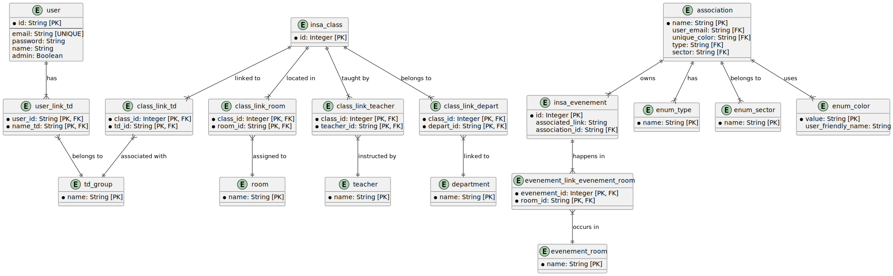

# InsAccess
This web app is designed for INSA Rouen Normandie, aiming to provide a simple class agenda similar to [INSAgenda](https://github.com/INSAgenda). However, its focus is on enabling associations and clubs at INSA to add custom events, along with other student utilities. This project is **not intended to replace INSAgenda** but rather to serve as an alternative for those who wish. Primarily, it is a fun project created as an opportunity to explore web app development.

# Table of content
- [Installation](#installation)
- [Development](#dev)
	- [Code Structure](#struct)
	- [Utility Scripts](#util)
	- [Static Files and Librairies](#static)
- [Models](#models)
- [Production](#prod)

# Installation <div id='installation'/>
- Set up the database (MariaDB is recommended, but other databases should work).
- Create a `config.json` file for the flask app by using the  `config-template.json`
- Create a Python virtual environment and install dependencies:
	```
	python3 -m venv venv
	source venv/bin/activate  # On Windows, use `venv\Scripts\activate`
	pip install -r requirements.txt
	```
- Launch the `test_insertion.py` file for initializing the app (this file is only temporary)

# Development <div id='dev'/>
-  launch the flask server
```
flask run --debug
```
-  if you're using mariadb you can access the tables by doing the following
```
sudo mariadb
>>> USE app;
```
## Code Structure<div id='struct'/>
- `app/blueprints` contains various modules that defines the available routes organized by `blueprint` (https://flask.palletsprojects.com/en/stable/blueprints/)
	- `main.py` defines the main routes.
	- `api.py` defines the route for the application apis, used between the front and the back to retrieve or post values to the server.
	- `auth.py` code for handling authentication - code is fully generic and is not meant to be modified. Function requiring authentication should take the decorator `@login_required`
	- `admin.py` defines the managing route for the admin of the website (used mainly to add association or to handle error)
	- `parameters.py` define the settings route.
- `app/static` contains all the css,js,font files needed to run the app, there shouldnt have any HTML file, as dynamic hmtl file generation using jinja and flask templates are preferable.
- `app/template` contains the differents HTML template used by the app (as said previously, those template use `jinja` to limit redundancy)
- `app/utils` contains various utility scripts for fetching the database, inserting it and so on.
- `app/data` contains the data files such as default user for development
- `app/tests` contains the python file used for testing during development


The factory for the Flask application is defined in `app/__init.py__` and is called dynamically `flask` when the `run.py`  or `test_insertion.py` module is called.

## Utility Scripts<div id='util'/>
- a short summary on how to use the different modules in `utils`
	- for `fetch.py` simply `import` `get_data_calendar_data` or `fetch_entire_year` or use in cmd by following this command : `python3 fetch.py <current_year> <department> <department_year> <date> <period_of_time>` with :
		- **current_year** the year the scholar year started at (2024 for the year 2024-2025) 
		- **department** the department ("ITI", "GM", "PERF-II"...)
		- **department_year** the year in the department (i.e 1, 2, 3, 4, 5)
		- **date** the date you want to fetch (ex : 10 march 2024 <=> 20240310)
		- **the period of time** the period you want to fetch (day, week, month)
	> for day, simply put the day (ex : 20250123 for 2025/01/23), for week, must be the sunday previous to the week you wanna fetch (for the 12 to 16 then fetch at 11), for month, simply fetch at the first day of the month
	- for `db_insertion.py` simply `import` `insert_list_records` or `insert_record_in_db`
	- `query_analyser` is still a work in progress
	
## Static Files and Libraries<div id='static'/>
`app/static` directory contains all the css, javascript libraries and static images. The global hmtl structure relies on bootstrap 5 and some javascript libraries used :
- `jquery` https://jquery.com/
- `flatpickr` https://flatpickr.js.org


# Models <div id='models'/>
- the models are defined in `app/models.py`  and are created using SQLAlchemy ORM, the main differents models are :
	- `User` for the authentification and for storing custom user preferences
	- `InsaClass` for storing the various classes done at INSA as well as the custom event created by the clubs and associations
	- `Teacher`,`Room`,`Department`,`GroupTD` for storing the names of the teacher, rooms, department and td groups.
	- `...Link...` for storing the various one to many table links.
	
# Production<div id='prod'/>
Deployment instructions are yet to be completed. :)
